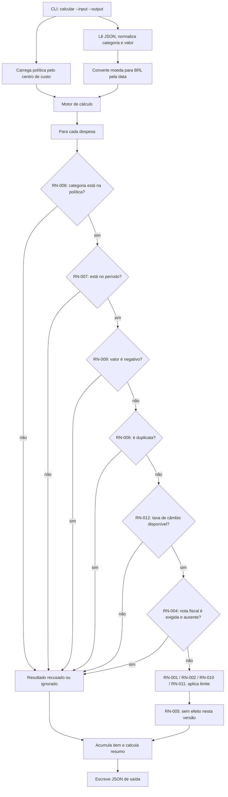

# Fluxo de processamento e verificação

Este diagrama representa o fluxo executado pela CLI e pelo motor de reembolso.
Uma despesa deixa de percorrer a cadeia na primeira regra que produz um
`ResultadoItem`; somente as despesas que chegam às regras de limite participam
das agregações diárias.

## Verificação

- **Implementação:** `src/cli.py` carrega a política por centro de custo e as
  taxas de câmbio; `src/io_json.py` normaliza a entrada e converte valores para
  BRL; `src/motor.py` aplica a sequência exibida acima.
- **Limites:** `src/regras.py` aplica RN-001, RN-002 e RN-010 às categorias
  originais, e RN-011 às categorias dinâmicas da política.
- **Evidência executável:** a suíte `python -m pytest -q` terminou com **33
  testes aprovados** em 2026-07-30, incluindo cenários de envelope, câmbio e
  política por centro de custo.

## Pendência documental identificada

O fluxo do código está consistente com o diagrama. Entretanto, a seção 8 de
`specs/001-motor-reembolso/spec.md` ainda não enumera RN-012 entre RN-006 e
RN-004, nem RN-011 entre as regras de limite. Isso é uma divergência de
documentação: não altera a execução, mas a seção deve ser atualizada antes da
entrega para que a especificação reflita o fluxo real.
